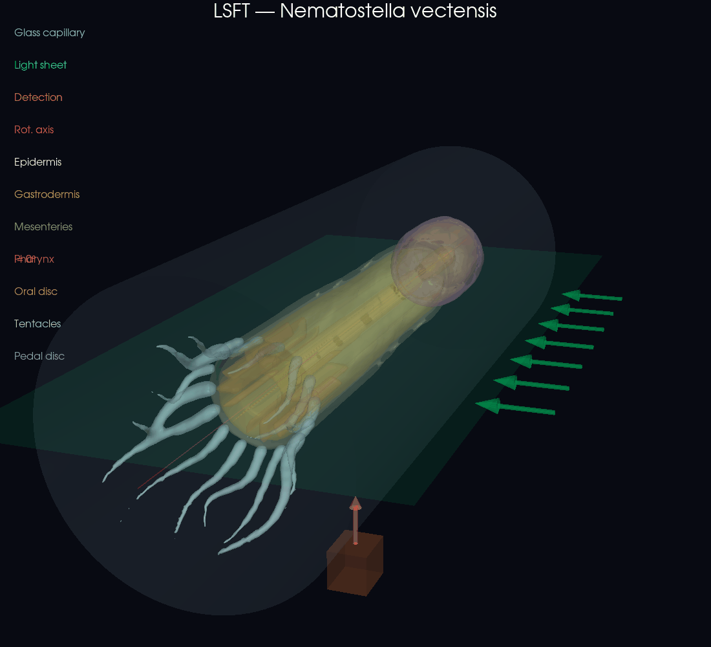

# napari-lsft

**Light Sheet Fluorescence Tomography** — napari plugin for 3D reconstruction from rotational light-sheet microscopy data.



*Principle, shown on a* Nematostella vectensis *phantom: a thin light sheet optically sections the sample inside the capillary while it rotates about the capillary (X) axis. Each rotation angle contributes a polar slice of the YZ cross-section, which is regridded (polar → Cartesian) into the reconstructed 3D volume.*

## Geometry

This plugin reconstructs 3D volumes from a specific optical setup:

- **Sample** (e.g. *Nematostella vectensis*) mounted in a **capillary** along the X axis
- **Light sheet** generated by a galvo scanner, propagating along Y, thin in Z
- **Detection** from below (or the side) along Z — the camera sees the XY plane
- **Sample rotation** around the X axis (capillary axis)

```
        Z (detection axis)
        ↑
        |     light sheet (XY plane)
        |   ═══════════════════
        |         ┃ capillary ┃  → X (rotation axis)
        |   ═══════════════════
        └──────────────────────→ Y
```

### Why not inverse Radon?

Unlike classical OPT (Optical Projection Tomography), where the camera integrates fluorescence along the entire detection path, the **light sheet provides an optical section**. Each camera pixel measures fluorescence at a specific point, not a projection.

For a fixed X position and rotation angle θ, a detector pixel at position y_lab corresponds to the **sample point**:

```
y_sample = y_lab · cos(θ)
z_sample = y_lab · sin(θ)
```

This is a **polar sampling** of the YZ cross-section. Reconstruction is therefore a coordinate transformation (polar → Cartesian), not an inverse Radon transform.

## Installation

```bash
pip install napari-lsft
```

Or for development:

```bash
git clone https://github.com/s1alknau/napari-lsft.git
cd napari-lsft
pip install -e .
```

## Usage

1. Open napari
2. Go to **Plugins → LSFT Reconstruction**
3. Load your rotational data (TIFF stack, HDF5, or Zarr)
4. Configure geometry (angle range, center of rotation)
5. Click **Reconstruct**
6. Export result as TIFF or HDF5

### Input data format

The input should be a 3D array of shape `(n_angles, n_x, n_y)`:

| Axis | Meaning |
|------|---------|
| 0 | Rotation angles |
| 1 | X — along the capillary (light-sheet scan direction) |
| 2 | Y_lab — detector pixels perpendicular to capillary |

### Parameters

| Parameter | Description |
|-----------|-------------|
| Angle start/stop | Rotation range in degrees (typically 0–180°) |
| Center offset | Rotation axis offset from detector center (pixels) |
| Auto-center | Automatically estimate center of rotation |
| Output size | Reconstructed slice size (auto = same as n_y) |
| Downsample | Spatial downsampling factor (< 1 for faster preview) |
| Interpolation | Linear (fast) or Cubic (quality) |
| Pre-filter σ | Gaussian smoothing on sinograms before reconstruction |
| Post-filter σ | Gaussian smoothing on reconstructed volume |

## Supported formats

- **TIFF** stacks (`.tif`, `.tiff`)
- **HDF5** files (`.h5`, `.hdf5`) — auto-detects first 3D dataset
- **Zarr** arrays (`.zarr`) — supports lazy loading via dask

## License

BSD-3-Clause
